<h1 align="center">Hi, I'm Urme</h1>

<b>Machine Learning Engineer · Trustworthy ML for Human-Centered AI</b>

 

  <picture><source media="(prefers-color-scheme: dark)" srcset="https://skillicons.dev/icons?i=py%2Cpytorch%2Csklearn%2Cts%2Creact%2Cjs%2Cfastapi%2Cdocker&theme=dark"></picture>

 

<picture><source media="(prefers-color-scheme: dark)" srcset="./profile/stats.svg"></picture>&nbsp;<picture><source media="(prefers-color-scheme: dark)" srcset="./profile/top-langs.svg"></picture>

 

## Projects

<table width="100%">
<thead>
<tr><th width="24%">Project</th><th>Tech stack</th><th width="13%">Links</th></tr>
</thead>
<tr><td><b><a href="https://github.com/urme-b/CalmSense">CalmSense</a></b></td><td>scikit-learn&nbsp;&nbsp;·&nbsp;&nbsp;XGBoost&nbsp;&nbsp;·&nbsp;&nbsp;PyTorch&nbsp;&nbsp;·&nbsp;&nbsp;SHAP&nbsp;&nbsp;·&nbsp;&nbsp;FastAPI</td><td align="center"><a href="https://urme-b.github.io/CalmSense/">Live demo</a></td></tr>
<tr><td><b><a href="https://github.com/urme-b/NexusRAG">NexusRAG</a></b></td><td>Sentence-Transformers&nbsp;&nbsp;·&nbsp;&nbsp;DeBERTa-NLI&nbsp;&nbsp;·&nbsp;&nbsp;LanceDB&nbsp;&nbsp;·&nbsp;&nbsp;Ollama</td><td align="center"><a href="https://github.com/urme-b/NexusRAG#what-the-benchmark-shows">Benchmark</a></td></tr>
<tr><td><b><a href="https://github.com/urme-b/NovaVision">NovaVision</a></b></td><td>PyTorch&nbsp;&nbsp;·&nbsp;&nbsp;Diffusers&nbsp;&nbsp;·&nbsp;&nbsp;Stable Diffusion&nbsp;&nbsp;·&nbsp;&nbsp;CLIP</td><td align="center"><a href="https://github.com/urme-b/NovaVision#results">Results</a></td></tr>
<tr><td><b><a href="https://github.com/urme-b/Multimodal-Multisensor">Multimodal-Multisensor</a></b></td><td>scikit-learn&nbsp;&nbsp;·&nbsp;&nbsp;PCA / K-Means&nbsp;&nbsp;·&nbsp;&nbsp;pandas&nbsp;&nbsp;·&nbsp;&nbsp;SciPy</td><td align="center">—</td></tr>
<tr><td><b><a href="https://github.com/urme-b/Sensor">Sensor</a></b></td><td>Python&nbsp;&nbsp;·&nbsp;&nbsp;pandas&nbsp;&nbsp;·&nbsp;&nbsp;HRV / eye-tracking / GSR</td><td align="center">—</td></tr>
<tr><td><b><a href="https://github.com/urme-b/Psychometric">Psychometric</a></b></td><td>JavaScript&nbsp;&nbsp;·&nbsp;&nbsp;Bootstrap&nbsp;&nbsp;·&nbsp;&nbsp;jsPDF</td><td align="center"><a href="https://urme-b.github.io/Psychometric/">Live demo</a></td></tr>
<tr><td><b><a href="https://github.com/urme-b/PulseShift">PulseShift</a></b></td><td>Python&nbsp;&nbsp;·&nbsp;&nbsp;scikit-learn&nbsp;&nbsp;·&nbsp;&nbsp;Node.js&nbsp;&nbsp;·&nbsp;&nbsp;SQLite</td><td align="center"><a href="https://urme-b.github.io/PulseShift/">Live demo</a></td></tr>
<tr><td><b><a href="https://github.com/urme-b/Antenna">Antenna</a></b></td><td>CST Studio Suite&nbsp;&nbsp;·&nbsp;&nbsp;VBA&nbsp;&nbsp;·&nbsp;&nbsp;RF / VNA</td><td align="center">—</td></tr>
<tr><td></td><td><picture></picture></td><td></td></tr>
</table>
