<h1 align="center">Hi, I'm Urme</h1>

<b>Software Engineer · Trustworthy ML for Human-Centered AI</b>

  
  

  

  
  

## Projects

<table width="100%">
<tr><th width="24%">Project</th><th>Tech stack</th></tr>
<tr><td><b><a href="https://github.com/urme-b/CalmSense">CalmSense</a></b></td><td>scikit-learn&nbsp;&nbsp;·&nbsp;&nbsp;XGBoost / LightGBM&nbsp;&nbsp;·&nbsp;&nbsp;PyTorch&nbsp;&nbsp;·&nbsp;&nbsp;SHAP&nbsp;&nbsp;·&nbsp;&nbsp;FastAPI&nbsp;&nbsp;·&nbsp;&nbsp;Docker</td></tr>
<tr><td><b><a href="https://github.com/urme-b/NexusRAG">NexusRAG</a></b></td><td>Sentence-Transformers&nbsp;&nbsp;·&nbsp;&nbsp;BM25&nbsp;&nbsp;·&nbsp;&nbsp;DeBERTa-NLI&nbsp;&nbsp;·&nbsp;&nbsp;LanceDB&nbsp;&nbsp;·&nbsp;&nbsp;Ollama&nbsp;&nbsp;·&nbsp;&nbsp;FastAPI</td></tr>
<tr><td><b><a href="https://github.com/urme-b/NovaVision">NovaVision</a></b></td><td>PyTorch&nbsp;&nbsp;·&nbsp;&nbsp;Diffusers&nbsp;&nbsp;·&nbsp;&nbsp;Stable Diffusion&nbsp;&nbsp;·&nbsp;&nbsp;CLIP&nbsp;&nbsp;·&nbsp;&nbsp;DistilRoBERTa</td></tr>
<tr><td><b><a href="https://github.com/urme-b/Multimodal-Multisensor">Multimodal-Multisensor</a></b></td><td>pandas&nbsp;&nbsp;·&nbsp;&nbsp;NumPy&nbsp;&nbsp;·&nbsp;&nbsp;SciPy&nbsp;&nbsp;·&nbsp;&nbsp;scikit-learn&nbsp;&nbsp;·&nbsp;&nbsp;PCA / K-Means&nbsp;&nbsp;·&nbsp;&nbsp;Jupyter</td></tr>
<tr><td><b><a href="https://github.com/urme-b/Sensor">Sensor</a></b></td><td>Python&nbsp;&nbsp;·&nbsp;&nbsp;pandas&nbsp;&nbsp;·&nbsp;&nbsp;Jupyter&nbsp;&nbsp;·&nbsp;&nbsp;HRV / eye-tracking / GSR sensor data</td></tr>
<tr><td><b><a href="https://github.com/urme-b/Psychometric">Psychometric</a></b></td><td>JavaScript&nbsp;&nbsp;·&nbsp;&nbsp;HTML / CSS&nbsp;&nbsp;·&nbsp;&nbsp;Bootstrap&nbsp;&nbsp;·&nbsp;&nbsp;jsPDF&nbsp;&nbsp;·&nbsp;&nbsp;offline-first</td></tr>
<tr><td><b><a href="https://github.com/urme-b/PulseShift">PulseShift</a></b></td><td>Python&nbsp;&nbsp;·&nbsp;&nbsp;scikit-learn&nbsp;&nbsp;·&nbsp;&nbsp;pandas&nbsp;&nbsp;·&nbsp;&nbsp;JavaScript&nbsp;&nbsp;·&nbsp;&nbsp;GitHub Pages</td></tr>
<tr><td><b><a href="https://github.com/urme-b/Antenna">Antenna</a></b></td><td>CST Studio Suite&nbsp;&nbsp;·&nbsp;&nbsp;VBA&nbsp;&nbsp;·&nbsp;&nbsp;RF / VNA measurement</td></tr>
</table>
